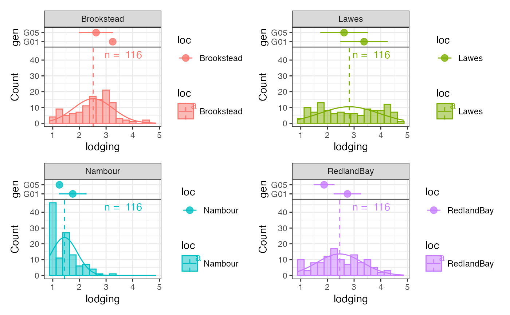

# Highlight Genotypes in Group-wise Histograms using Group-wise Point and Error Bar Plots

Load the required packages.

``` r
library(avial)
library(agridat)
library(ggplot2)
library(patchwork)
```

Prepare the example data from `agridat`.

``` r
soydata <- australia.soybean

clrs <- c("#B2182B", "#2166AC", "#009E53", "#E69F00")
clrs_dark <- colorspace::darken(clrs, amount = 0.2)

checks <- c("G01", "G05")
checkdata <- soydata[soydata$gen %in% checks, ]
```

Plot the basic group-wise histogram

``` r
outg_hist_list <-
  groupwise_histogram(data = soydata, group = "loc", trait = "lodging",
                      background.hist = FALSE,
                      background.density = FALSE,
                      hist.alpha = 0.5,
                      density = FALSE,
                      subset = "list")
wrap_plots(outg_hist_list, nrow = 2, guides = "collect")
```


Plot the genotypes to highlight as a group-wise point and error bar
plots.

``` r
outg_list <-
  groupwise_dumbell(data = checkdata, group = "loc",
                    trait = "lodging", genotype = "gen",
                    subset = "list")
wrap_plots(outg_list, nrow = 2, guides = "collect")
```


Stack the two plots together using `patchwork`.

``` r

gps <- levels(soydata$loc)

outg_stacked_list <-
  lapply(seq_along(gps), function(i) {
    
    top <- outg_list[[i]] +
      # Remove xlab
      xlab("") +
      # Remove x axis ticks and text
      theme(axis.ticks.x = element_blank(),
            axis.text.x = element_blank())
    
    bottom <- outg_hist_list[[i]] +
      # Remove facet strip
      theme(strip.background = element_blank(),
            strip.text = element_blank())
    
    # Standardize xlim of two plots
    xrange <- c(layer_scales(top)$x$range$range,
                layer_scales(bottom)$x$range$range)
    
    top <- top + xlim(c(min(xrange), max(xrange)))
    bottom <- bottom + xlim(c(min(xrange), max(xrange)))
    
    top / plot_spacer() / bottom +
      plot_layout(heights = c(1, -1.7, 4), guides = "collect")
    
  })
#> Scale for x is already present.
#> Adding another scale for x, which will replace the existing scale.
#> Scale for x is already present.
#> Adding another scale for x, which will replace the existing scale.
#> Scale for x is already present.
#> Adding another scale for x, which will replace the existing scale.
#> Scale for x is already present.
#> Adding another scale for x, which will replace the existing scale.
#> Scale for x is already present.
#> Adding another scale for x, which will replace the existing scale.
#> Scale for x is already present.
#> Adding another scale for x, which will replace the existing scale.
#> Scale for x is already present.
#> Adding another scale for x, which will replace the existing scale.
#> Scale for x is already present.
#> Adding another scale for x, which will replace the existing scale.

wrap_plots(outg_stacked_list, nrow = 2, guides = "collect")
```


